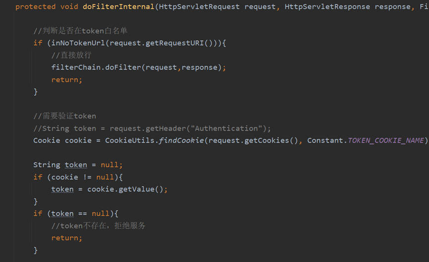

# Student_Management_System
A student management system based on Springboot and Vue.

# 查看本目录下的jar文件夹readme.md，两步即可启动项目

# 一、管理系统及背景

## 1.1作业选题

**学生管理系统**

## 1.2设计目的

  学生管理系统的设计目的是为了有效地管理学校内的学生信息、课程信息和相关数据，提高学校管理的效率和透明度。

系统旨在集中管理学生的基本信息，包括个人资料、联系方式等。这有助于学校迅速获取学生信息，更好地了解学生群体的整体状况。学生管理系统有助于管理学校提供的各种课程信息，包括课程表、课程内容、教师信息等。通过系统化的课程管理，学校能够更好地组织和安排教学活动。学生成绩是学校管理的重要组成部分。

学生管理系统可以有效记录和管理学生成绩，提供成绩查询和分析功能，帮助学校了解学生的学术表现和发展趋势。学生管理系统提供了丰富的数据和报告，为学校管理层提供决策支持。通过分析学生数据，学校可以更好地制定教育政策和改进管理流程。学生管理系统有助于确保学生信息的安全性和隐私性。它可以限制对敏感信息的访问，并提供安全措施以防范潜在的数据泄露或滥用。学生管理系统的设计目的是提高学校管理效率、促进学生发展，同时加强学校与学生之间的沟通，为教育管理提供更科学、便捷和可靠的工具。

## 1.3设计背景

数据库管理系统（DBMS）在社会中扮演着重要而广泛的角色，对个人、组织和整个社会都有积极的影响。以下是数据库管理系统在社会中的一些重大作用：

DBMS允许有效地组织和存储大量的数据。这使得信息能够更容易地被管理、检索和更新。无论是企业、政府还是个人，都能够更高效地利用信息。

数据库系统通过实施事务机制确保数据的一致性和可靠性。这对于财务、医疗、教育等领域尤为重要，能够避免数据错误和不一致。数据库中存储的大量数据可用于分析和生成报告，支持组织和政府进行决策制定。商业智能和数据挖掘技术的应用使得从数据中提取有价值的信息变得更加容易。在组织和企业中，DBMS可以加速日常业务流程。通过快速、准确地检索和更新数据，员工可以更高效地完成任务，提高工作效率。DBMS允许多个用户在同时访问和共享数据，这在团队协作和信息共享方面起到了积极的作用。这对于多部门协同工作的大型组织来说尤其重要。

在数字化时代，电子商务和在线服务依赖于数据库来存储和管理大量的产品信息、订单、用户数据等。DBMS的可靠性和高效性对于在线交易的成功至关重要。通过存储和管理客户信息，企业可以提供更个性化、高效的客户服务。数据库系统使得客户数据的整合和实时访问成为可能。在科学研究中，数据库用于存储和分析实验数据、文献资料等。这有助于研究人员更好地管理、共享和理解科学数据，推动科学研究的发展**【1】**。

总体而言，数据库管理系统在社会中的作用是多方面且深远的。它们促进了信息的管理和利用，提高了工作效率，支持了决策制定，对于推动社会的数字化和信息化进程发挥了关键作用。

# 二、学生管理系统架构

针对本作业要求的内容，本管理系统采用**B/S式（浏览器/服务器）**的系统架构。

 

## 2.1技术栈：

1.前端采用**html** + **css** + **javaScript** 部署在服务器静态资源下

框架使用情况：

Vue2，Axios，ElementUI，MD5，

2.后端采用Java框架**SpringBoot**，控制层框架**SpringMVC**，持久层框架**Mybatis**

框架使用情况：

SpringBoot**【2】**，SpringMVC，MyBatis，Jwt

3.数据库使用**mysql**数据库

数据库管理系统：Navicat

## 2.2硬件设备：

**线上部署：阿里云服务器（i-bp1b2x2ap86u6f3qyjdu）**

**配置信息：**

| 硬件设备     | 硬件性能             |
| ------------ | -------------------- |
| **实例规格** | **ecs.e-c1m1.large** |
| **vCPU**     | 2                    |
| **内存**     | **2Gib**             |
| **带宽**     | **100Mbps**          |
| **操作系统** | **Centos(7.9)**      |

 

## 2.3环境配置：

**Linux - Java环境配置**

  **tar -zxvf  jdk-8u161-linux-x64.tar.gz** **解压jar包**  

**在/etc/profile下配置环境变量**  

**运行项目Jar包**

**nohup java -jar management-core-1.0-SNAPSHOT.jar >msg.log  2>&1 &**  

 

**Docker部署mysql**

 

**#拉取服务**  docker  pull mysql 

**#挂载镜像**  docker  run -id -p 3307:3306 --name=mysql -v $PWD/conf:/etc/mysql/conf.d -v $PWD/logs:/logs -v  $PWD/data:/var/lib/mysql -e  MYSQL_ROOT_PASSWORD=root mysql:5.7 

**#进入镜像内部**  docker  exec -it mysql /bin/bash  

**#修改mysql密码**  SET  PASSWORD FOR 'root' = PASSWORD ('new_password')

**#修改localhost密码**  SET  PASSWORD FOR 'root'@'localhost' = PASSWORD ('new_password') 

**#刷新**  flush  privileges;  

 

**Nginx网关配置**

**安装Nginx**

  **开放图床src接口**  

#图片配置      location /image/ { 

​         alias  /image/student_management/;        

  autoindex on;    

  }  

## 2.4技术栈使用详情表：

| **使用技术栈**     | **技术栈特点**                                   |
| ------------------ | ------------------------------------------------ |
| **HTML**           | 实现基本的Web元素和GUI                           |
| **CSS**            | 实现对web元素的美化和修改                        |
| **Javascript**     | 进行界面以及按钮的逻辑处理                       |
| **Vue2**           | 数据与元素的双向绑定，响应式编程。               |
| **Axios**          | 封装XMLHttpRequest，异步处理响应。               |
| **ElementUI**      | 轻量级前端框架，快速上手构建UI界面。             |
| **MD5**            | 不可逆加密且具有唯一性                           |
| **SpringBoot**     | 约定大于配置，IOC，AOP实现高内聚低耦合。         |
| **SpringMVC**      | 视图与模型解耦，自动匹配控制层接口               |
| **Mybatis**        | 高效ORM映射模型                                  |
| **JSON Web Token** | 用户认证解决方案                                 |
| **Navicat**        | 使用该软件对数据库进行管理、数据导入、数据库配置 |

# 三、需求分析-前端

**主页面模块：**

主页面模块被分为以下8个模块：

Ø **学生管理**

负责学生信息的增删改查

Ø **教师管理**

负责教师信息的增删改查

Ø **课程管理**

负责课程信息的增删改查

Ø **选课管理**

负责选课信息的增删改查

Ø **授课管理**

负责授课信息的增删改查

Ø **班级管理**

负责班级信息的增删改查

Ø **用户管理**

负责用户信息的增删改查

Ø **成绩管理**

负责成绩的多种高级查询

 

以上模块主页面按照数据列表的形势进行渲染展示并提供相应的增删改查页面。

## 3.1数据列表

​                               

**图** **1****数据列表-学生**

 

数据列表主要负责数据信息的展示，数据的增加，修改，删除，信息的查询。

 

## 3.2分页需求

 

**图** **2****分页组件**

 

前端需要设计一套分页组件，支持分页单位的选择，前一页，后一页按钮，同时数据列表随着分页组件的改变而同时响应。

同时也要携带当前查询条件向后端重新获取分页结果。

分页组件注意点：需要做前一页，最后一页的判定，当前页为首页或尾页时，用户无法点击前一页或后一页。

分页单位改变：由于分页单位改变会使得当前页的值不确定，因此统一跳转回第一页

## 3.3添加数据

提供添加数据按钮，提供css样式以支持按钮在鼠标悬浮，按下不同状态的颜色以增加用户体验。

绑定按钮点击事件，跳转到数据增加页面。

**数据增加页面**

**图** **3****数据增加**

 

数据增加页面提供对应的数据采集表单，同时提供数据提交按钮。提供一个返回连接到原数据列表页面。

注意点：需要在提交前对表单数据进行空值检查，要求表单完善。

## 3.4数据修改

需要在数据列表中的每一栏数据添加对应的数据编辑按钮，在点击对应数据编辑按钮的时候跳转到数据修改页面。

注意点：由于浏览器跳转页面无法保存上一个页面的数据，因此在跳转前将修改的主键值保存到浏览器会话域(session)中提供数据修改界面使用。

 

**数据修改页面**

图 4数据修改

 

数据修改页面要求数据的回显，通过会话域保存的主键值去后端查询数据结果返回填入表单。同时提供修改按钮，提供用户提交修改结果。

## 3.5数据删除

 

**图** **5****数据删除**

 

与编辑类似需要提供删除按钮，但是不同之处在于无需做页面跳转，只需要携带删除数据的主键到后端即可。删除完自动向后端再次请求一次分页查询获取到新的列表信息。

## 3.6数据查询

 

图 6数据查询

 

提供一个查询关键字输入框，查询按钮，以及查询列选项，增加精确查询勾选框。

查询关键字默认设置为模糊查询，数据库中用%%进行匹配查询返回结果。

查询列选项作为可选的查询字段依据，如姓名则按照姓名字段作为查询依据进行查询。

精确查询勾选框表明本次查询不是模糊查询，禁止使用%%进行匹配，而是直接进行值匹配查询。

如学生输入完整的学号以查询学生信息。

## 3.7菜单模块

 

图 7菜单模块

 

菜单模块对应着主要操作页面的菜单，其数据渲染依据依托于当前用户的角色，不同角色的用户渲染的菜单数量不同。

以下是不同用户组的菜单列表

1.管理员：所有菜单

2.教师：除了用户管理的所有菜单

3.学生：学生管理，选课管理，成绩管理

同时提供一个退出登录连接，在点击后注销用户，向服务器请求删除token Cookie

后并返回登录页面。

## 3.8登录模块

 

图 8登录模块

 

登录模块支持用户登录，使用密码输入框。

提交到后端的数据需要进行md5加密以保证密码与数据库用户密码匹配。

登录模块是后端开放的无需token访问界面，因此也是用户获取token的唯一界面，只有在获取到token后才能访问其它页面，否则服务器一律拒绝服务与提供页面资源。

## 3.9用户中心

 

图 9用户中心

 

图 10更改头像/密码

 

用户中心提供了用户头像上传修改接口，提供用户更改密码接口。上传头像接口将头像保存到服务器图床地址，并将图像url保存到数据库。

更改密码接口则需要用户在登录状态下携带token才能进行修改。

## 3.10 系统消息

 

图 11系统消息

 

系统消息可以由管理员发送给用户，若有新文件将在用户界面左上角铃铛图标显示气泡提示。用户可以打开消息界面查看系统消息。未读新消息会有new字样气泡提示，同时提供消息删除图标。

 

图 12消息发送

 

管理员则可以打开消息发送页面，可以选择消息可见角色将系统消息进行推送。

 

 

 

 

## 3.11 工作流程图

 

工作流程图

## 3.12 功能模块汇总

 

功能结构图

# 四、需求分析-后端

## 4.1后端布局

 

图 13控制层-业务层-映射层

 

\1.    后端以控制层-表现层-映射层的架构布局

\2.    其中控制层负责url路径与后端资源的映射

\3.    业务层负责主要的业务逻辑

\4.    映射层负责映射持久层接口方法与XML资源内的SQL语句映射

## 4.2鉴权控制

​     

图 14切面配置

后端鉴权控制，由于本项目角色简单，且项目周期较短因此选择了较为便捷的注解式鉴权。

为控制层配置鉴权代理，这里使用了AOP编程，配置环绕通知。

若当前请求用户不属于本接口开放的用户组，则服务器拒绝服务。

 

**鉴权前提：**

后端对用户的识别与用户信息存储。

由于项目较小就没有引入redis进行token缓存了，将token存储在httpOnlyCookie中。

**前端鉴权：**

根据menu_role表获取到当前用户对应角色所对应的菜单地址，并将其动态的渲染到前端菜单列表上。

## 4.3 Token认证

 

图 15 Token认证

 

考虑到token需要在每次与后端交互的请求中携带并解析，因此后端需要配置一个单次过滤器（也可以配置拦截器）。

具体方案是开放一个前端白名单，开放login接口和html资源，js资源，css资源的开放接口。

其它接口需要进行token的认证，通过jwt工具类解析token，并将解析出的登录用户信息存储到session。

后期方案：将token设置到httpOnly cookie防止跨域伪造攻击。

初次获取token：用户只能从开放的login接口通过账户和密码认证后获取token。

## 4.4 SQL注入

为了防止SQL注入后端使用了Mybatis框架的OGNL表达式，其底层使用了jdbc的prepareStatement。其工作原理是先将要注入的查询参数位置用?保留。先组装sql语句，并将sql先进行预编译传给数据库，然后再将参数传给数据库替换掉原来?的位置，这样就保证了sql代码和查询参数的分离，防止了恶意sql注入。

## 4.5业务层逻辑

### 4.5.1 用户管理业务层

1.用户登录

用户登录需要获取到前端传输的用户名和用户密码（MD5加密），调用业务层查询方法去数据库找符合条件的匹配项，若匹配成功则返回用户信息封装为token存入HttpOnlyCookie，响应成功登录。

2.用户登出

用户登出通过查找对应的token Cookie字段删除响应头里的cookie即可。

3.用户修改密码

从token中获取登录用户id，根据修改密码表单与用户id去数据库更新对应用户的密码即可。

4.添加用户

先去数据库检查用户名是否被使用过，若存在同名用户则返回提示信息。若不存在同名用户则可以添加用户。

5.更新用户

通过前端提供的更新用户信息去数据库更新用户信息，若重置密码项勾选则将用户密码设置为123456的MD5值保存数据库即可。

6.查询用户信息

通过前端传入的分页条件计算当前分页起始索引，去查询到符合记录条目总数，计算分页起始索引，去数据库查询相关数据通过limit获取分页查询结果。同时按照精确查询开关去模糊匹配或是精确匹配按照字段标识获取到的匹配字段与关键字。

7.删除用户

通过前端传入的删除用户uid去数据库匹配对应的用户进行删除。

### 4.5.2 学生管理业务层

1.添加学生

在添加数据的同时按需创建学生类型账户，学生账户生成方式：账户名为 100 + 班级号 + 班内最大学号加一 (如果是1号班级1号学生则为 100101)。班级内账户最大学号不得超过99，否则不允许添加。学生所在班级人数+1。

2.更新学生信息

更新学生信息时需要在原来的班级人数上减1，在新的班级上人数加1，将前端传入的更新数据按照对应学生id更新学生数据。

3.查询学生信息

通过前端传入的分页条件计算当前分页起始索引，去查询到符合记录条目总数，计算分页起始索引，去数据库查询相关数据通过limit获取分页查询结果。同时按照精确查询开关去模糊匹配或是精确匹配按照字段标识获取到的匹配字段与关键字。

4.删除学生

通过传入的学生id信息去删除对应匹配记录，若学生存在对应的用户账户则删除对应学生账户。

 

### 4.5.4 教师管理业务层

1.添加教师

按照前端提供的教师信息为数据库新增教师信息记录即可。

2.更新教师信息

按照前端提供的更新教师信息，通过教师id匹配对应记录进行更新即可。

3.查询教师信息

通过前端传入的分页条件计算当前分页起始索引，去查询到符合记录条目总数，计算分页起始索引，去数据库查询相关数据通过limit获取分页查询结果。同时按照精确查询开关去模糊匹配或是精确匹配按照字段标识获取到的匹配字段与关键字。

4.删除教师

先检查教师是否有绑定的授课记录，若无绑定的授课记录则通过传入的教师id信息去删除对应匹配记录，否则提示教师授课不为0给前端

### 4.5.4 班级管理业务层

1.添加班级

按照前端提供的班级信息为数据库新增班级信息记录即可。

2.更新班级信息

按照前端提供的更新班级信息，通过班级id匹配对应记录进行更新即可。

3.查询班级信息

通过前端传入的分页条件计算当前分页起始索引，去查询到符合记录条目总数，计算分页起始索引，去数据库查询相关数据通过limit获取分页查询结果。同时按照精确查询开关去模糊匹配或是精确匹配按照字段标识获取到的匹配字段与关键字。

4.删除班级

先检查班级人数是否为0，若班级人数为0则通过传入的班级id信息去删除对应匹配记录，否则提示人数不为0给前端。

### 4.5.5 授课管理业务层

1.添加授课

按照前端提供的授课信息为数据库新增授课信息记录即可。

2.更新授课信息

按照前端提供的更新授课信息，通过授课id匹配对应记录进行更新即可。

3.查询授课信息

通过前端传入的分页条件计算当前分页起始索引，去查询到符合记录条目总数，计算分页起始索引，去数据库查询相关数据通过limit获取分页查询结果。同时按照精确查询开关去模糊匹配或是精确匹配按照字段标识获取到的匹配字段与关键字。

4.删除授课

先检查授课对应的选课人数是否为0，若选课人数为0则通过传入的授课id信息去删除对应匹配记录，否则提示选课人数不为0给前端。

### 4.5.6 选课管理业务层

1.添加选课

按照前端提供的选课信息为数据库新增选课信息记录即可，初始选课课程分数设置为“暂无成绩”。

2.更新选课信息

按照前端提供的更新选课信息，通过选课id匹配对应记录进行更新即可。

3.查询选课信息

通过前端传入的分页条件计算当前分页起始索引，去查询到符合记录条目总数，计算分页起始索引，去数据库查询相关数据通过limit获取分页查询结果。同时按照精确查询开关去模糊匹配或是精确匹配按照字段标识获取到的匹配字段与关键字。

4.删除选课

通过传入的选课id信息去删除对应匹配记录。

5.成绩查询

根据前端传入的查询条件，如匹配字段，过滤条件（平均分，最高分，最低分，及格率）去数据库查询结果并返回给前端，注意分数字段查询不统计“暂无成绩”的数据库分数记录。

 

### 4.5.7 课程管理业务层

1.添加课程

按照前端提供的课程信息为数据库新增课程信息记录即可。

2.更新课程信息

按照前端提供的更新课程信息，通过课程id匹配对应记录进行更新即可。

3.查询课程信息

通过前端传入的分页条件计算当前分页起始索引，去查询到符合记录条目总数，计算分页起始索引，去数据库查询相关数据通过limit获取分页查询结果。同时按照精确查询开关去模糊匹配或是精确匹配按照字段标识获取到的匹配字段与关键字。

4.删除课程

先检查课程绑定的授课人数是否为0，若授课人数为0则通过传入的课程id信息去删除对应匹配记录，否则提示授课人数不为0给前端。

### 4.5.8 消息管理业务层

1.发布消息

由前端传入发布消息的内容，发布者id，获取系统时间计算发布时间，将消息记录存入数据库。通过推送者权限组去查询符合权限条件的用户id列表。按照符合条件的用户id列表为消息读取记录表插入用户消息读取记录，默认消息读取状态为未读。

2.用户已读/删除

按照token中的登录用户id和已读或删除的消息id去消息读取记录表匹配符合条件的记录，更新消息读取状态字段值即可。

3.查询消息

根据登录用户id查询用户相关的消息读取记录列表（不读取状态为已删除消息的记录），将读取记录列表的消息id整理为id列表去消息记录表查询符合条件的Map集，为消息Vo注入消息内容数据，同时按照消息id整理为id列表去用户表查询符合条件的Map集，为消息Vo注入发布者数据。

（此业务逻辑为高并发设计，实际开发中的三表联查可以直接通过单次sql联表查询即可实现，但本业务逻辑旨在降低联表查询带来的数据库性能开销，将主要性能开销转移到服务器端，降低数据库负荷；若采用联表查询只用建立一次数据库连接，采用此方案需要连接三次数据库，但降低了三表联查大笛卡尔积带来的性能影响；）

最后将结果返回给前端即可。

### 4.5.9 角色管理业务层

1.查询角色

根据用户信息包含的rid查询对应的角色信息即可。

2.查询角色列表

将数据库角色列表查询返回即可。

### 4.5.10文件上传业务层

1.上传文件

为本地mutipart工厂配置默认工厂位置，设置为预设的服务器图床文件地址。

通过前端传入的图像文件数据将文件转储到图床位置。通过雪花算法计算新的图像id拼接Nginx网关代理的图床基础Url作为前端图像src路径保存到数据库。前端图像即可通过src直接访问图像数据。

### 4.5.11学期查询业务层

1.查询学期列表

按照学期开始年份排序查询结果，且查询结果不包含4年前的学期。

### 4.5.12菜单查询业务层

1.获取菜单列表

通过token认证的用户rid查询匹配到的菜单信息，将此用户角色拥有的菜单列表信息传给前端处理即可。

# 五、数据库设计

## ER图

 

 
